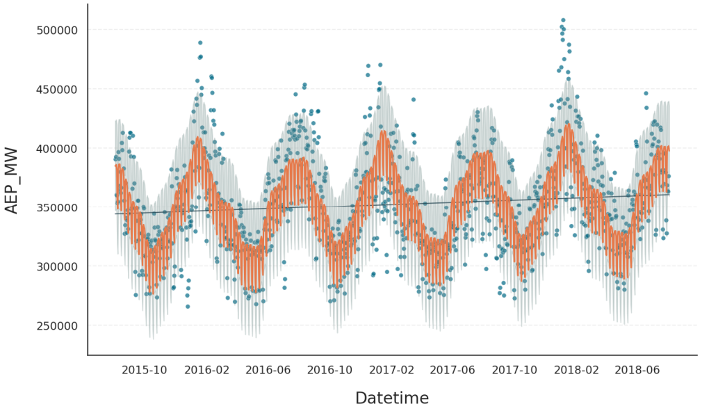
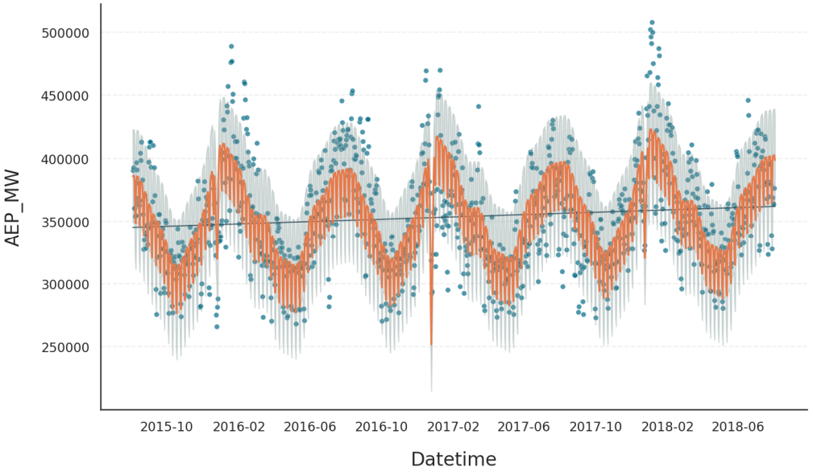

.. _ref-calendric-data:

.. currentmodule:: gloria
.. autosummary::
   :template: autosummary/small_class.rst
   :toctree: get_started/

Calendric Data
==============

Gloria defines calendric data as time-series that are affected by yearly, quarterly, monthly, weekly, or daily seasonalities as well as public holidays. As this covers a wide range of diverse data sets, Gloria offers convenience functionalities to set up your models for calendric data.

To demonstrate them, we once more employ the power consumption data set, but aggregate it on a daily basis and restrict it to the last 3 years. Also we set up the usual model without changepoints, and include yearly and weekly seasonalities. The plot showing this first bare fit is shown below.

.. code:: python

    import pandas as pd
    from gloria import Gloria
    
    # Load the data
    url = "https://raw.githubusercontent.com/e-dyn/gloria/main/scripts/data/real/AEP_hourly.csv"
    data = pd.read_csv(url)

    # Convert to datetime
    data["Datetime"] = pd.to_datetime(data["Datetime"])
    
    # Aggregate hourly data to weekly data
    data = data.resample('d', on="Datetime").sum().reset_index().iloc[2:-1].tail(3*365)
    
    # Set up the Gloria model
    m = Gloria(
        metric_name="AEP_MW",
        timestamp_name="Datetime",
        sampling_period="1 d",
        n_changepoints=0,
    )
    
    # Add observed seasonalities
    m.add_seasonality("weekly","7d",3)
    m.add_seasonality("yearly","365.25d",10)
    
    # Fit the model to the data
    m.fit(data)

    # Predict
    prediction = m.predict(periods=1)
    
    # Plot the results
    m.plot(prediction, include_legend=True)
   

    

Holiday Regressor
-----------------

Next, we add a single holiday, namely Christmas Eve, using :meth:`~Gloria.add_event` together with the :class:`Holiday` event regressor. Note that the holiday name must match exactly how it is registered in the `holidays <https://holidays.readthedocs.io/en/latest/>`_ package, which Gloria uses internally. You must also specify the ``country`` of origin as a two-letter ISO code.

.. code-block:: python

    from gloria import Holiday, Gaussian
    
    # Add Christmas
    m.add_event(
        name="Christmas Day",
        regressor_type="Holiday",
        event=Gaussian(width="2d"),
        country="US"
    )

.. tip::
  To explore which holidays are available for a given country, use the :func:`get_holidays` function and inspect its ``all_holiday_names`` output.

The resulting fit shows a somewhat unexpected dip in power consumption - likely caused by a surge in candle use to boost holiday spirit.

  
Use of Protocols
----------------

:ref:`Protocols <ref-api-protocols>` let you bundle the seasonalities and events that make sense for a given dataset and add them to a Gloria model in one shot. With the :class:`CalendricData` protocol, you can configure the full model including standard seasonal cycles and country-specific holidays by calling a single helper, instead of adding everything manually:

.. code-block:: python

    from gloria import Gloria, CalendricData
    
    # Set up the Gloria model
    m = Gloria(
        metric_name="AEP_MW",
        timestamp_name="Datetime",
        sampling_period="1 d",
        n_changepoints=0,
    )
    
    # Create the protocol
    calendric_protocol = CalendricData(country = "US")
    
    # Add the protocol
    m.add_protocol(calendric_protocol)

The resulting plot below shows that two to three out of 13 added holidays have a measurable impact on the fit.

.. note::

    * Seasonalities and events are not added to the model when :meth:`~Gloria.add_protocol` is called but during the subsequent :meth:`~Gloria.fit` procedure.
    * Manually added seasonalities and events take precedence over their protocol counterparts. If you wish to treat a single holiday differently from the rest, simply add it using :meth:`~Gloria.add_event`.
    * The ruleset applied by the calendric data protocol when adding seasonalities mimics Prophet's behaviour for the better part. Refer to :class:`CalendricData` for details.