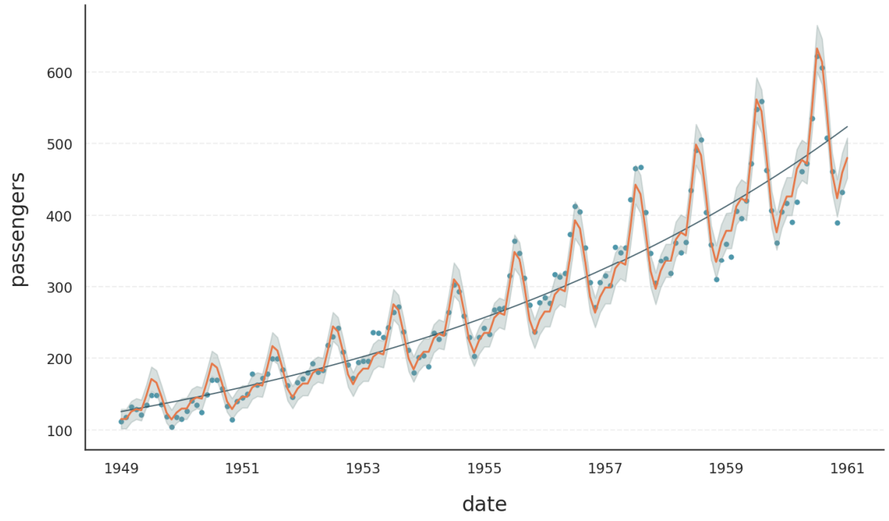
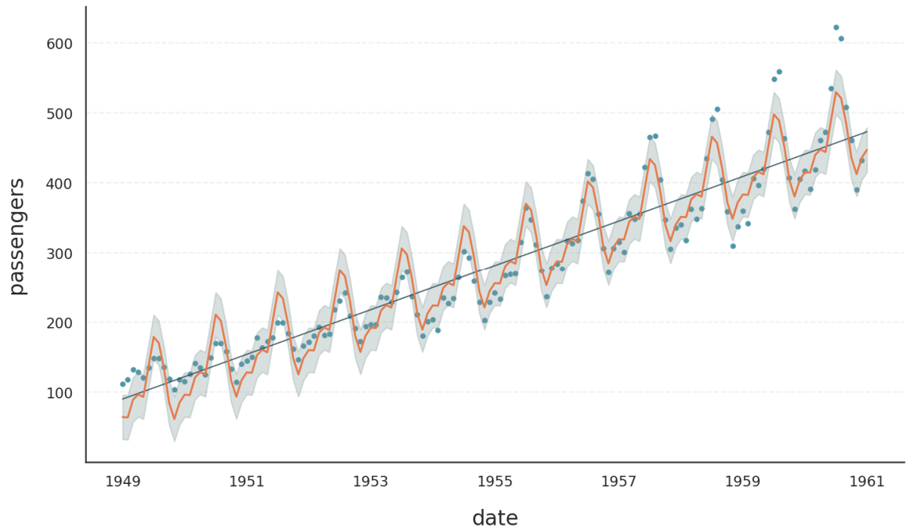

.. _ref-decomposition_types:
.. currentmodule:: gloria
.. autosummary::
   :template: autosummary/small_class.rst
   :toctree: get_started/

Decomposition Types
===================

Gloria models are based on the well-known decomposition of time-series :math:`Y(t)` as a function of time :math:`t` into trend :math:`T(t)`, seasonality :math:`S(t)`, and a residual error term :math:`E(t)`. There are two major ways to perform the decomposition:

- **Additive decomposition**: :math:`Y(t) = T(t) + S(t) + E(t)`
- **Multiplicative decomposition**: :math:`Y(t) = T(t) \times S(t) \times E(t)`

Additive models assume *independent components*, i.e. they simply add up. Multiplicative models on the other hand can be used to introduce interactions, eg. when seasonalities grow with the trend.

In the last section on :ref:`model selection <ref-model-selection>`, we saw how different distribution models support various data types and bounds. In this tutorial, we explore how models inherently support different decomposition types, making an explicit selection between *additive* and *multiplicative* modes unnecessary.

.. note::

  Forcing a certain decomposition type can even violate the bounds of distribution models. Think of the *gamma distribution* with lower bound of zero. With vanishing trend :math:`T(t) = 0` and a simple sinusoidal seasonality :math:`S(t) = \sin(t)`, an additive model would cause :math:`Y(t)` to be negative half the time.
  
Link Functions
--------------

Gloria uses `generalized linear models <https://en.wikipedia.org/wiki/Generalized_linear_model>`_ behind the scenes, that is, it makes a weighted sum over trend, seasonal components and other regressors. The outcome of this sum does not respect the bounds of the response variable :math:`Y(t)`. Therefore, a link function is used mapping the domain of :math:`Y(t)` to the unbounded regime of the linear model. The following link functions are used for Gloria's models:

.. rubric:: Identity Link Function

The arguably simplest link function is the identity function. It leaves the linear model unchanged and results in **additive decomposition** according to

.. math::
  Y(t) = T(t) + S(t) + E(t) = T_\text{GLM}(t) + S_\text{GLM}(t) + E_\text{GLM}(t)
  
where the index *GLM* refers to the components on the scale of the linear model. The identity link function is used for the **normal** distribution model.

.. rubric:: Log Link Function

The log link function can be used for models with a lower bound of zero. Calculating the response variable using the **inverse** link function results in **multiplicative decomposition**:

.. math::
  Y(t) = T(t) \times S(t) \times E(t) = \exp\left[T_\text{GLM}(t) + S_\text{GLM}(t) + E_\text{GLM}(t)\right]
  
where we identify :math:`T(t)=\exp\left[T_\text{GLM}(t)\right]` etc. The log-link function is used for **poisson**, **negative binomial** and **gamma** distribution models.

.. rubric:: Logit Link Function

The logit or log-odds link function is used for models with a lower *and* upper bound. The resulting model shows a **hybrid decomposition** with multiplicative behaviour close to the bounds and approximately additive behaviour right in between. The response variable is given by the inverse link - the logistic function:

.. math::
  Y(t) = \frac{1}{1+ e^{-T_\text{GLM}(t) - S_\text{GLM}(t) - E_\text{GLM}(t)}}
  
Gloria uses the logit link function for **binomial**, **beta**, and **beta-binomial** distributions.

Comparison of Types
-------------------

To illustrate additive vs. multiplicative behaviour, we take a look at a well-known example showing multiplicative behaviour, namely the `Air Passengers <https://www.kaggle.com/datasets/rakannimer/air-passengers>`_ data set available at Kaggle. The following code fits and plots the data with a *poisson* model for count data. 

.. note::
    It is worth mentioning that the data set is sampled on a monthly basis. As the length of a month varies, Gloria cannot handle monthly data directly. Instead we resample the data using the *average* length of a month.

.. code-block:: python

  import pandas as pd
  from gloria import Gloria, cast_series_to_kind

  # Read the data
  url = "https://raw.githubusercontent.com/e-dyn/gloria/main/scripts/data/real/AirPassengers.csv"
  data = pd.read_csv(url)

  # Rename columns for convenience
  data.rename(
      {"Month": "date", "#Passengers": "passengers"}, axis=1, inplace=True
  )

  # Convert to datetime
  data["date"] = pd.to_datetime(data["date"])

  # Make a new monthly column with equidistant spacing
  freq = pd.Timedelta(f"{365.25/12}d")
  data["date"] = pd.Series(
      pd.date_range(
          start=data["date"].min(), periods=len(data["date"]), freq=freq
      )
  )

  # Cast to unsigned data type so it is digestible by count models
  data["passengers"] = cast_series_to_kind(data["passengers"], "u")

  # Set up the model
  m = Gloria(
      model="poisson",              # <-- change to "normal" for comparison
      metric_name="passengers",
      timestamp_name="date",
      sampling_period=freq,
      n_changepoints=0,
  )

  # Add observed seasonalities
  m.add_seasonality("yearly", "365.25 d", 4)

  # Fit the model to the data
  m.fit(data)

  # Plot
  m.plot(m.predict(), include_legend=True)
  
The result is shown in the plot below. We can see an exponentially growing trend, nicely tracing the data average. Also, the oscillations scale with the trend as one expects from a multiplicative model.

   
The next image shows the result of the same code, but using the *normal* distribution. The fit is much worse, showing a strictly linear trend and constant seasonality amplitudes.

