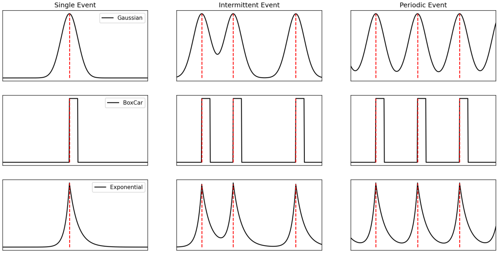
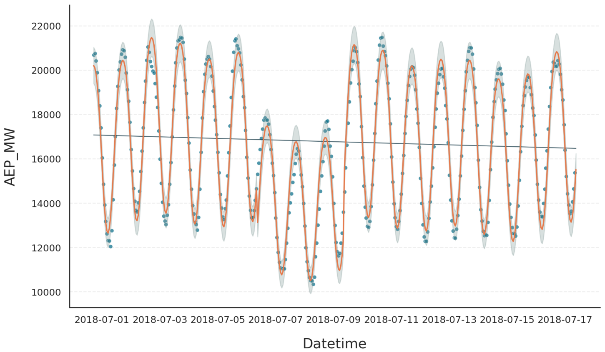
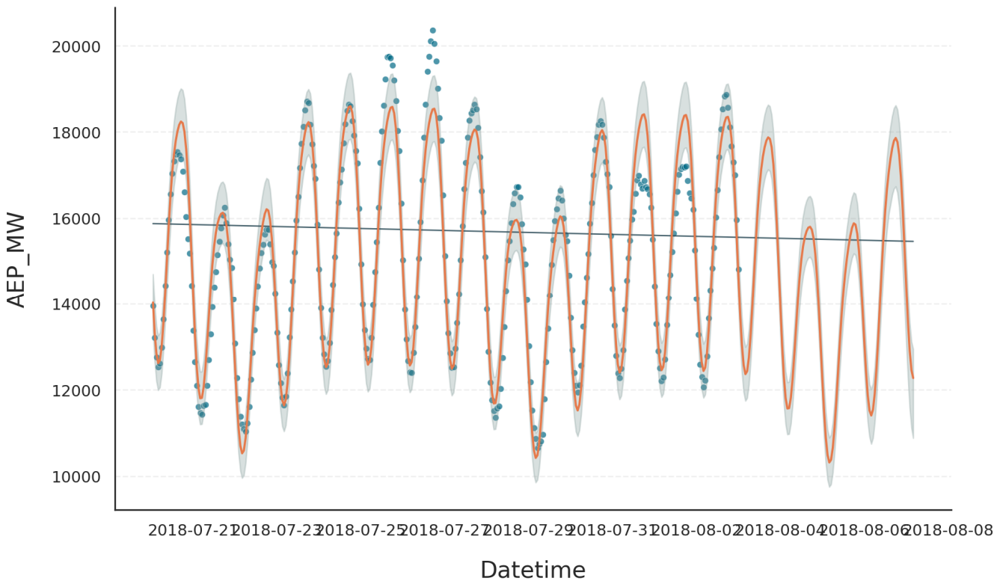

.. _ref-events-tutorial:
.. currentmodule:: gloria

Events
======

Conceptual Idea
---------------

Gloria provides a flexible framework for representing events in your dataset. Imagine, for instance, a brief one-off dip in the data - just like the drop we saw in the :ref:`modeling trends <ref-modeling-trends>` example between July 6th and 9th. Although we captured that behaviour by tweaking the trend component, describing it as an event is a more intuitive approach and becomes especially valuable when similar events repeat.

In Gloria, every event has two key parts:

1. **Anchor**: a reference instant that marks where the event is aligned in time. Anchors are managed through *event regressors*, namely :class:`SingleEvent`, :class:`IntermittentEvent`, :class:`PeriodicEvent`, and :class:`Holiday`.
2. **Profile**: the temporal shape that unfolds around each anchor. All profiles available in Gloria are of type :ref:`Event <ref-events>` and include :class:`BoxCar`, :class:`Gaussian`, :class:`Cauchy`, and :class:`Exponential`.

The figure illustrates the idea. In the first column you see :class:`SingleEvent` instances that occur only once: each row shows a different profile (black solid line), all aligned to the same anchor time (red dashed vertical line).

You can place several anchors along the time axis - irregularly or at equal intervals - yielding the patterns in the second and third columns and corresponding to :class:`IntermittentEvent` and :class:`PeriodicEvent`, respectively. At every anchor, the same profile is stamped. Mathematically, the full signal is the convolution of one profile with the collection of anchor times.

  
Adding Event Regressors
-----------------------

As mentioned, an event consists of an *event regressor* and an *event profile* attached to it. The snippet below builds a single‐occurrence event using the built-in :class:`SingleEvent` regressor together with a three-day :class:`BoxCar` profile:

.. code-block:: python

    from gloria import Gloria, BoxCar
    
    # Define the event profile
    event = BoxCar(width="3d")          # three-day flat pulse
    
    # Create a Gloria model
    m = Gloria()
    
    # Add event to model
    m.add_event(
        name="drop", 
        regressor_type="SingleEvent",   # choose the regressor class 
        event=event,                    # attach the profile
        t_start="2018-07-06 9:00:00"    # anchor time
    )
    
The :meth:`~Gloria.add_event` method takes the profile via ``event=event`` and selects the regressor with ``regressor_type="SingleEvent"``. Any further arguments required by that regressor - in this case the anchor time ``t_start`` - are passed as keyword parameters.

The following script is a full example modelling the drop in the power consumption dataset using the event we just created. Note that compared to the :ref:`modeling trends <ref-modeling-trends>` section we turned off changepoints using ``n_changepoints=0``:

.. code-block:: python
    
    import pandas as pd
    from gloria import Gloria, BoxCar

    # Load the data
    data = pd.read_csv("data/AEP_hourly.csv")

    # Save the column names for later usage
    timestamp_name = "Datetime"
    metric_name = "AEP_MW"

    # Convert to datetime
    data[timestamp_name] = pd.to_datetime(data[timestamp_name])
    
    # Restrict data
    window_duration = 400
    window_start = 800
    data = data.sort_values(by="Datetime").iloc[
        -window_start : -window_start + window_duration
    ]

    # Set up the Gloria model
    m = Gloria(
        model="gamma",
        metric_name=metric_name,
        timestamp_name=timestamp_name,
        sampling_period="1 h",
        n_changepoints=0,
    )

    # Add observed seasonalities
    m.add_seasonality("daily", "24 h", 2)
    m.add_seasonality("weekly", "7 d", 2)

    # Create the event profile
    event = BoxCar(width="3d")

    # Add event to model with desired event regressor
    m.add_event(
        name="drop", 
        regressor_type="SingleEvent", 
        event=event,
        t_start = "2018-07-06 9:00:00"
    )

    # Fit the model to the data
    m.fit(data)

    # Predict
    prediction = m.predict(periods=1)

    # Plot
    m.plot(prediction)

In the figure below the fit reproduces the observed drop convincingly. The only visible artefact is a small jump at the event's onset. This stems from the boxcar profile's infinitely sharp leading edge; replacing it with a flat-top :class:`Gaussian` profile with ``order > 1`` smooths the edge and removes the discontinuity.

Recurring Events
----------------

Besides modelling single-occurrence events with :class:`SingleEvent`, Gloria offers specialised regressors for recurring patterns:

* :class:`IntermittentEvent` for events that repeat at irregular times, by passing the complete list of anchor timestamps
* :class:`PeriodicEvent` for events that repeat on a fixed period, by specifying any anchor time plus the period
* :class:`Holiday` for country- and region-specific public holidays.

.. tip::
  :class:`Holiday` is Gloria's analogue to Prophet's holiday component, but it is more flexible: you may attach any event profile, whereas Prophet is limited to 1-day boxcars. See the :class:`CalendricData` protocol as well as our :ref:`calendric data <ref-calendric-data>` tutorial on configuring Gloria models similar to Prophet.

The next example shows how to capture the regular weekend drop in power consumption discussed in :ref:`Basic Usage <ref-basic-usage>`. We omit the weekly seasonality term and instead insert a :class:`PeriodicEvent` that places a Gaussian profile at the midpoint of each weekend.

.. code-block:: python
    :emphasize-lines: 28, 36, 38, 39
    
    import pandas as pd
    from gloria import Gloria, Gaussian

    # Load the data
    data = pd.read_csv("data/AEP_hourly.csv")

    # Save the column names for later usage
    timestamp_name = "Datetime"
    metric_name = "AEP_MW"

    # Convert to datetime
    data[timestamp_name] = pd.to_datetime(data[timestamp_name])

    # Restrict data
    data = data.sort_values(by = "Datetime").tail(336)

    # Set up the Gloria model
    m = Gloria(
        model="gamma",
        metric_name=metric_name,
        timestamp_name=timestamp_name,
        sampling_period="1 h",
        n_changepoints=0,
    )

    # Add observed seasonalities
    m.add_seasonality("daily", "24 h", 2)
    # m.add_seasonality("weekly", "7 d", 2)  # <-- weekly component removed

    # Create the event profile
    event = Gaussian(width="18h")

    # Add event to model with desired event regressor
    m.add_event(
        name="drop", 
        regressor_type="PeriodicEvent",      # <-- periodic event regressor
        event=event,
        t_start = "2018-07-29 5:00:00",      # <-- midpoint of weekend
        period = "7d"                        # <-- weekly period
    )

    # Fit the model to the data
    m.fit(data)

    # Predict
    prediction = m.predict(periods=100)

    # Plot
    m.plot(prediction, dpi = 200)

The fit confirms that a periodic event regressor can mimic seasonal structure in both training data and forecast. This approach is especially useful when the seasonality is too intricate to approximate with a small number of Fourier components.

    