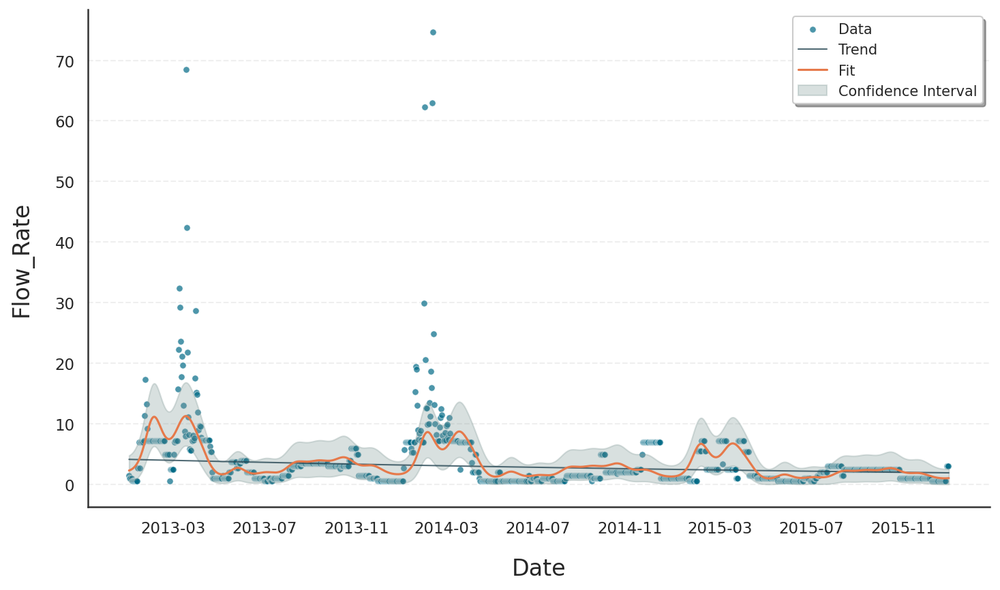
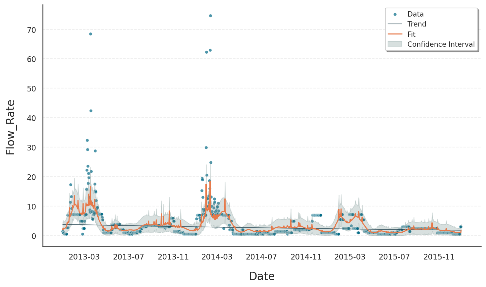

.. _ref-external_regressors:
.. currentmodule:: gloria
.. autosummary::
   :template: autosummary/small_class.rst
   :toctree: get_started/

External Regressors
===================

Incorporating external regressors can significantly improve the quality and interpretability of time series forecasts. While autoregressive models focus solely on the internal dynamics of a time series (e.g., trends, seasonality, autocorrelation), they may miss important **exogenous influences**, that is factors outside the series that systematically affect its behavior.

Typical examples of external regressors include:

- Weather data
- Economic indicators

Ignoring these variables can lead to biased estimates, unexplained variability, and underperforming forecasts.

Baseline Fit with Default Model
-------------------------------

We are going to use daily data showing the **water level** of Lake Bilancino in Italy [#f1]_. The dataset originates from open hydrological measurements and contains several relevant variables, including:

- ``Date``: A timestamp column representing daily measurements
- ``Rainfall_X``: It indicates the quantity of rain falling, expressed in millimeters (mm), in the area X
- ``Flow_Rate``: It indicates the lake's flow rate, expressed in cubic meters per seconds (mc/s)

This data provides an ideal basis for time series forecasting, particularly because flow rate respond both to internal seasonal patterns and external hydrological dynamics such as rainfall.

In the first part of this example, we restrict ourselves to the **default model configuration**, based on Gloria’s core methodology. 

We start by applying Gloria with the following assumptions:

- **No changepoints** to capture structural shifts in water level trends
- A **Gamma distribution** to model a positive, right-skewed variation
- **Daily frequency** (1-day sampling interval)
- **Yearly seasonality** to account for periodic hydrological patterns

Let’s begin by preparing the data and fitting this baseline model.

.. code-block:: python

    # For loading and processing
    import pandas as pd
    # For forecasting and setting up Gloria
    from gloria import Gloria, cast_series_to_kind, CalendricData

    # Load the data
    url = "https://raw.githubusercontent.com/e-dyn/gloria/main/scripts/data/real/Lake_Bilancino.csv"
    data = pd.read_csv(url)

    # Save the column names and data configurations for later usage
    n_changepoints = 0
    model = "gamma"
    metric_name = "Flow_Rate"
    timestamp_name = "Date"
    sampling_period = "1 d"

    # Convert to datetime
    data["Date"] = pd.to_datetime(data["Date"], format="%d/%m/%Y")

    # Restrict data
    data_gloria = data[
        (data["Date"] >= "2013-01-01")
        & (data["Date"] <= "2015-12-31")
        & (data[metric_name].notna())
    ].reset_index(drop=True)

    # Sort data by Date
    data_gloria = data_gloria.sort_values(by="Date")

    # Set up the model
    m = Gloria(
        model=model,
        metric_name=metric_name,
        timestamp_name=timestamp_name,
        sampling_period=sampling_period,
        n_changepoints=n_changepoints
    )

    # Add seasonalities
    protocol = CalendricData(yearly_seasonality=True, weekly_seasonality=False)
    m.add_protocol(protocol)

    # Fit the model to the data
    m.fit(data_gloria)

    # Predict
    future_dates = m.make_future_dataframe(periods=1)
    prediction = m.predict(future_dates)

    # Plot
    m.plot(prediction, include_legend = True)

Although a forecast is produced that formally satisfies the assumptions of the selected model - in this case, the **Gamma distribution** —- the results still reveal important shortcomings when modeling lake level dynamics **without external regressors**:

- The Gamma distribution correctly ensures that predicted values are **strictly positive** and can handle **right-skewed** distributions, which is appropriate for many natural measurements like water levels.
- However, because the model relies **solely on internal patterns** such as trend and seasonality, it cannot respond to **external shocks** or variations caused by hydrological drivers like inflow or drainage.
- As a result, the forecasts may still **miss critical inflection points** or shifts in the data, especially during anomalous events or periods of sudden change.

In short, without external context such as the **rainfall** in specific areas, it cannot fully explain or anticipate the dynamics observed in the system, limiting both the **accuracy** and **interpretability** of its forecasts.

Improved Fit with External Regressors: Rainfall Inputs
------------------------------------------------------

To improve model performance and capture the true drivers of variation in flow rate, we now extend the model by incorporating **external regressors** — specifically, **rainfall measurements** from the various catchment areas that feed into the lake.

Although the lake’s inflow and outflow (`Flow_Rate`) is a key driver of water level changes, this variable is itself influenced by upstream precipitation. By including rainfall data from multiple hydrological zones as regressors, we provide Gloria with **causal context** that improves its ability to **explain and forecast** future changes in lake level.

It is crucial that the external regressor data are available and clean for every time point in the historical dataset to ensure a reliable fit. Furthermore, for forecasting, corresponding regressor values must be known or accurately forecasted for future periods. For weather-related regressors like rainfall, this dependency is often manageable over shorter forecast horizons, where meteorological predictions are typically more reliable.

We continue to use the **Gamma distribution**, which remains well-suited for modeling positive, skewed, and continuous quantities like lake levels. However, the model now includes a structured regressor component that helps modulate the forecast based on real-world environmental inputs.

.. code-block:: python

    # For loading and processing
    import pandas as pd
    # For forecasting and setting up Gloria
    from gloria import Gloria, cast_series_to_kind, CalendricData

    # Load the data
    url = "https://raw.githubusercontent.com/e-dyn/gloria/main/scripts/data/real/Lake_Bilancino.csv"
    data = pd.read_csv(url)

    # Save the column names and data configurations for later usage
    n_changepoints = 0
    model = "gamma"
    metric_name = "Flow_Rate"
    timestamp_name = "Date"
    sampling_period = "1 d"

    # Define regressor columns
    regressor_name = ["Rainfall_S_Piero", "Rainfall_Mangona",
                      "Rainfall_S_Agata", "Rainfall_Cavallina",
                      "Rainfall_Le_Croci"]

    # Convert to datetime
    data["Date"] = pd.to_datetime(data["Date"], format="%d/%m/%Y")

    # Restrict data
    data_gloria = data[
        (data["Date"] >= "2013-01-01")
        & (data["Date"] <= "2015-12-31")
        & (data[regressor_name].notna().all(axis=1))
        & (data[metric_name].notna())
    ].reset_index(drop=True)

    # Set up the model
    m = Gloria(
        model=model,
        metric_name=metric_name,
        timestamp_name=timestamp_name,
        sampling_period=sampling_period,
        n_changepoints=n_changepoints
    )

    # Add seasonalities
    protocol = CalendricData(yearly_seasonality=True, weekly_seasonality=False)
    m.add_protocol(protocol)

    # Add regressors
    for name in regressor_name:
        m.add_external_regressor(name=name, prior_scale = 5.0)

    # Fit the model to the data
    m.fit(data_gloria)

    # Predict
    future_dates = m.make_future_dataframe(periods=1)

    #  All external regressors must be available for both the entire historical
    # and future dataframes
    if isinstance(regressor_name, str):
        regressor_name = [regressor_name]

    future_dates = future_dates.merge(
        data[["Date"] + regressor_name], on="Date", how="left"
    )

    prediction = m.predict(future_dates)

    # Plot
    m.plot(prediction, include_legend = True)

The revised model leads to:

- More responsive predictions that reflect external influences
- Improved accuracy by incorporating causal drivers
- Confidence intervals that adapt to changes driven by regressors
- Enhanced interpretability through inclusion of meaningful external factors

.. rubric:: Summary

Incorporating external regressors into time series models like Gloria can substantially enhance forecast quality and interpretability. While traditional models capture internal dynamics such as trend and seasonality, they often miss crucial exogenous drivers that influence the target variable.

By including meaningful external regressors, the model benefits from:

- Greater responsiveness to real-world events and external shocks  
- Improved explanatory power by linking observed variations to causal factors  
- More accurate and robust forecasts with adaptive confidence intervals  
- Enhanced interpretability, enabling stakeholders to understand key influences on the series 
- Reliable performance only when regressor data is consistently available—both historically and (via forecast) into the future 

In practical applications, ensuring the availability of external regressors for both historical and future time points is essential to fully leverage their predictive potential.

Overall, extending Gloria with external regressors allows for richer, context-aware models that better reflect the complexities of real-world systems.

.. rubric:: Footnotes

.. [#f1] The data are available through `Kaggle <https://www.kaggle.com/code/iamleonie/intro-to-time-series-forecasting/input?select=Lake_Bilancino.csv>`_.