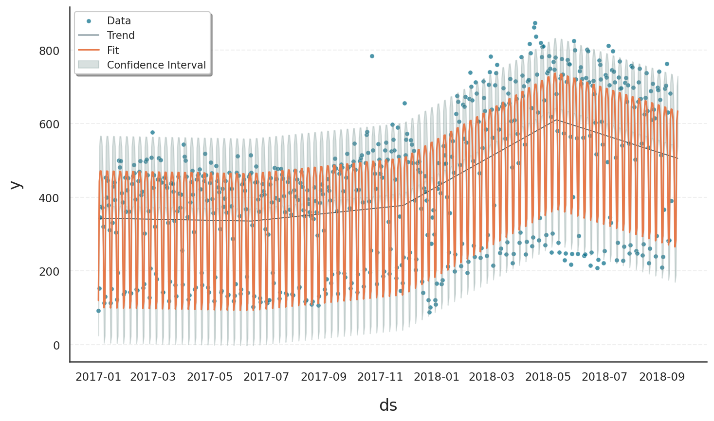
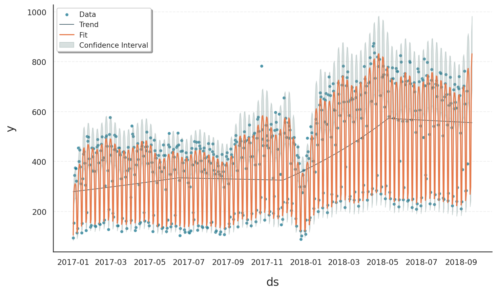

.. _ref-model-selection:

.. currentmodule:: gloria
.. autosummary::
   :template: autosummary/small_class.rst
   :toctree: get_started/

Model Selection
===============

Choosing the right statistical model is a key step in time series analysis. Different datasets come with different distributional characteristics - some are continuous, others are discrete; some are symmetric, others skewed or bounded. Gloria supports a range of probabilistic models to allow flexible, context-aware fitting and forecasting.

By default, Gloria uses the **Normal distribution**. This is suitable for many common use cases involving continuous data with symmetric noise. However, depending on the **data type** (e.g., counts, proportions, durations) and the **behavior** of the series (e.g., skewness, overdispersion, boundedness), more specialized models may yield significantly better results.

This section shows how model selection can improve both the **numerical performance** and the **interpretability** of your forecasts. We illustrate this using count data and the **Negative Binomial** model, but the same principle applies across a variety of models available in Gloria.

Here’s a **quick reference**:

.. list-table:: 
   :header-rows: 1
   :widths: 20 45 35

   * - Model
     - Mathematical Characteristics
     - ``model = ...`` 
   * - Gaussian
     - Continuous, symmetric, unbounded; mean = location, variance = spread
     - ``"normal"``
   * - Gamma
     - Continuous, positive-only; right-skewed; controlled by shape and rate
     - ``"gamma"``
   * - ExGaussian
     - Convolution of Normal and Exponential; skewed with heavy tail
     - not available
   * - Beta
     - Continuous on (0, 1); flexible shape; bounded and normalized
     - ``"beta"``
   * - Poisson
     - Discrete, positive integers; mean = variance (equidispersion)
     - ``"poisson"``
   * - Neg. Binomial
     - Discrete, positive integers; variance > mean (overdispersion)
     - ``"negative binomial"``
   * - Binomial
     - Discrete; bounded between 0 and n; fixed number of trials
     - ``"binomial"``
   * - Beta-Binomial
     - Discrete; bounded like Binomial; includes variability in success probability (overdispersed Binomial)
     - ``"beta-binomial"``

The last column in this table refers to the value you have to set for the ``model`` argument in the :class:`Gloria` constructor. 

The goal is always the same: choose the distribution that best reflects your data's constraints and variability.

Baseline Fit with Default Model
-------------------------------

We are going to use daily data showing the website traffic of data.lacity.org and geohub.lacity.org [#f1]_. The underlying CSV file contains several columns, including a timestamp column called ``Date``, metric columns such as ``Users``, ``Sessions``, and ``Bounce Rate`` for both websites, as well as an aggregated column representing the combined user count across both platforms.

In the first bit of code, we load the data and convert the ``Date`` to proper datetime objects. Due to some irregularities and missing entries at the beginning of the time series, we restrict the dataset to observations starting from 2017.

We first model the data using Gloria’s default settings. By default, Gloria assumes a Normal distribution, which models symmetric noise around the mean and does not impose constraints on predicted values.

Based on prior analysis of the series, we assume the following:

- There are three changepoints in the trend component, reflecting structural shifts in user behavior.
- The data exhibits weekly and yearly seasonality, likely driven by usage habits and calendar effects.
- We aim to forecast 30 days into the future.

This configuration allows us to explore the fit of the default model under realistic assumptions about periodicity and long-term trend changes.

.. code-block:: python

     # For loading and processing
    import pandas as pd            
    # For forecasting and setting up Gloria
    from gloria import CalendricData, Gloria, cast_series_to_kind  

    # Load the data
    url = "https://raw.githubusercontent.com/e-dyn/gloria/main/scripts/data/real/Open_Data_Website_Traffic.csv"
    data = pd.read_csv(url)

    # Convert to datetime
    data['Date'] = pd.DatetimeIndex(data['Date'])

    # Restrict data 
    data = data[data["Date"] >= "2017-01-01"].reset_index(drop=True)

    # Sort data by Date
    data_gloria = data.sort_values(by="Date")

    # Save the column names and data configurations for later usage
    metric_name="Socrata Sessions"
    timestamp_name="Date"
    sampling_period="1 d"
    n_changepoints=3

    # Set up the model
    m = Gloria(
    metric_name=metric_name,
    timestamp_name=timestamp_name,
    sampling_period=sampling_period,
    n_changepoints=n_changepoints
    )

    # Add seasonalities
    protocol = CalendricData(
        yearly_seasonality=False,
        weekly_seasonality=True
    )
    m.add_protocol(protocol)

    # Fit the model to the data
    m.fit(data_gloria)

    # Predict
    prediction = m.predict(periods=30)

    # Plot
    m.plot(prediction, include_legend=True)

Although a fit and forecast are produced that formally meet the chosen model’s requirements, the result is not well-suited for this type of data and leads to several shortcomings:

- Predicted values may be non-integer or even negative, which is not meaningful for count data. Since the observed values are discrete and strictly non-negative, this leads to interpretational problems.
- The Normal model assumes symmetric noise around the mean, but count data are naturally asymmetric due to the lower bound at zero. As a result, the model fails to reflect the skewness present in the data.
- This symmetry assumption often results in unrealistically narrow confidence intervals, particularly on the lower end where the model would allow for values below zero—something impossible in reality.

In short, although a Normal model may yield a mathematically valid fit, its structural assumptions are misaligned with the data's properties, which leads to both quantitative inaccuracies and qualitative misinterpretation.

Improved Fit with Suitable Model: Negative Binomial
---------------------------------------------------

To better model count data with high variability, we switch to the *Negative Binomial* distribution by setting ``model="negative binomial"`` in the :class:`Gloria` constructor. This model is particularly well suited for count data with overdispersion, as it includes a flexible dispersion parameter that allows the variance to deviate from the mean.

More importantly, it meets two essential requirements often seen in real-world count data:

- It enforces a natural lower bound at zero, ensuring that predicted values are non-negative [#f2]_.
- It operates on discrete (integer) values, rather than continuous ones.

This makes the Negative Binomial model an appropriate choice for modeling data that consist of positive integer values.

Since data is often read from CSV files as floating-point numbers, we first need to convert the relevant column to an unsigned integer type. Gloria provides the utility function :meth:`cast_series_to_kind` for this purpose:

.. code-block:: python

    # Cast data to uint64
    data_gloria[metric_name] = cast_series_to_kind(data_gloria[metric_name], "u")

    # Set up the model
    m = Gloria(
        model="negative binomial",
        metric_name=metric_name,
        timestamp_name=timestamp_name,
        sampling_period=sampling_period,
        n_changepoints=n_changepoints
    )

    # Add seasonalities
    protocol = CalendricData(
        yearly_seasonality=True,
        weekly_seasonality=True
    )

    m.add_protocol(protocol)

    # Fit the model to the data
    m.fit(data_gloria)

    # Predict
    forecast = m.predict(periods=30)

    # Plot
    m.plot(forecast, include_legend=True)

The revised model leads to:

- Realistic predictions (non-negative integers)
- More accurate reflection of data spread
- Asymmetric confidence intervals, capturing extreme days
- Better overall interpretability

.. rubric:: Summary

Different data types require different assumptions. Gloria provides a range of built-in probabilistic models to support modeling:

- Continuous, positive, bounded, and skewed values  
- Discrete counts or proportions  
- Overdispersed or irregular patterns

When the default Normal model does not align with your data characteristics, consider switching to a more suitable distribution. This small change can lead to more meaningful forecasts and reduce interpretational pitfalls.

Detailed Model Selection Logic
------------------------------

Choosing the correct distribution depends on:

1. Is the outcome **continuous** or **discrete**?
2. Are there **natural bounds** (e.g. zero, one, or upper limits)?
3. Is there **overdispersion** (variance > mean)?

The following decision tree helps guide model choice [#f3]_:

.. image:: pics/DecisionTreeData.png
   :width: 700
   :alt: Model selection decision tree

.. rubric:: Footnotes

.. [#f1] The data are available through `Data.gov <https://data.lacity.org/api/views/d4kt-8j3n/rows.csv?accessType=DOWNLOAD>`_.
.. [#f2] See also the `/scripts/03_demo_version switch.py <https://github.com/benkambs/gloria-betatest/blob/main/scripts/03_demo_version%20switch.py>`_ example.
.. [#f3] Figure inspired from `here <https://schmettow.github.io/New_Stats/glm.html>`_ 